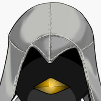

=======
Authors
=======

These are the authors of OpenCTR.

For a list of people who deserve credit, but did not actively participate in developing OpenCTR, please see :doc:`Credits`.

.. author_symbitic:

========
Symbitic
========

==================   ===========================
**Name**             Symbitic
**Real Name**        Alex Shaw
**URL**              https://alshaw.net
**GitHub Profile**   https://github.com/Symbitic
**email address**    alex.shaw.as@gmail.com
==================   ===========================

Original creator of OpenCTR. 22 years old. Favorite language is C. Not afraid to get down to the nitty-gritty low-level programming details, unlike most programmers today.

=============
Getting Added
=============

If you would like to join OpenCTR, please see the :doc:`Contributing` guide. 
If you are already a member of the OpenCTR developers but do not see your name here, please send an email to `Alex Shaw <mailto:alex.shaw.as@gmail.com>`_. 
Please include the following information:

* Your name (required)
* Your email address (required)
* Your real name (optional)
* Your home-page / URL (optional)
* Your github profile link (optional but strongly recommended)

